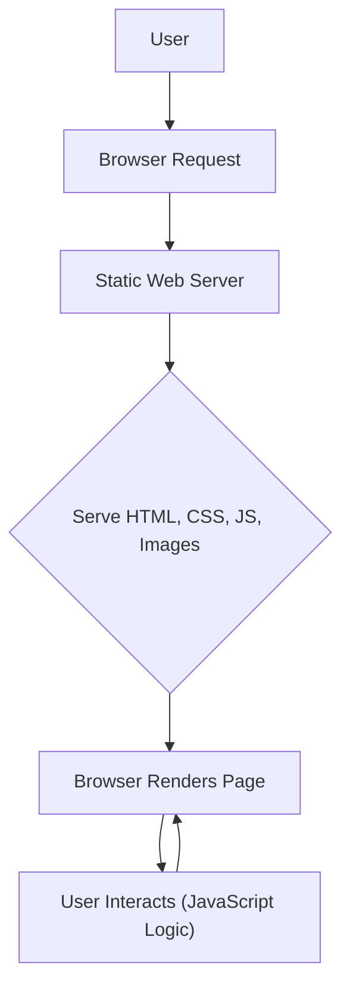

# 🚀 Portfolio Master

<p align="center"></p>

## Short Description
**Portfolio Master** is a cutting-edge, fully responsive, and highly customizable personal portfolio website template designed to showcase your work, skills, and personality with unparalleled elegance. Built with modern web standards, it provides a perfect foundation for developers, designers, freelancers, and artists to establish a compelling online presence. Get ready to impress!

## ✨ Key Features
*   **Stunning Responsive Design:** Flawlessly adapts to any device, from desktops to mobile phones, ensuring your portfolio looks incredible everywhere. (`website-demo-image/desktop.png`, `website-demo-image/mobile.png`)
*   **Dedicated Portfolio Showcase:** Highlight your best projects with visually engaging layouts and detailed descriptions. (`assets/images/project-*.jpg/png`)
*   **Integrated Blog Section:** Share your insights, experiences, and technical knowledge with a built-in blog. (`assets/images/blog-*.jpg`)
*   **Clear Skill & Service Presentation:** Effectively categorize and display your expertise using intuitive icons. (`assets/images/icon-app.svg`, `icon-design.svg`, `icon-dev.svg`, `icon-photo.svg`)
*   **Effortless Customization:** A clean and well-structured codebase allows for easy personalization to match your unique brand. (`assets/css/style.css`, `assets/js/script.js`)
*   **SEO-Friendly Structure:** Optimized for search engines to help potential clients and employers discover your work.

## Who is this for?
**Portfolio Master** is ideal for:
*   **Software Developers:** Showcase your coding projects and technical skills.
*   **UI/UX Designers:** Present your design mockups, prototypes, and case studies.
*   **Freelancers:** Attract new clients by demonstrating your expertise and past work.
*   **Artists & Creatives:** Display your visual art, photography, or multimedia projects.
*   **Students & Job Seekers:** Build a professional online resume to stand out in the job market.
*   Anyone looking to create a professional and dynamic online portfolio quickly and efficiently.

## Technology Stack & Architecture
This project is a pure front-end application, built with the fundamental pillars of web development, ensuring high performance, broad compatibility, and ease of deployment.

*   **HTML5:** For semantic structure and content organization. (`index.html`, `new.html`, `sanika.html`)
*   **CSS3:** For modern styling, animations, and responsive design. (`assets/css/style.css`)
*   **JavaScript:** For interactive elements, dynamic content, and enhanced user experience. (`assets/js/script.js`)

There are no server-side components or databases involved, making **Portfolio Master** incredibly lightweight and fast.

## 📊 Architecture & Database Schema
Given that **Portfolio Master** is a static, front-end only website, there is no traditional backend architecture or database schema. The flow focuses entirely on client-side interaction and the delivery of static assets.


This diagram illustrates the simplicity and directness of a static website. User requests are handled directly by a web server, which serves pre-built files (HTML, CSS, JavaScript, images) to the user's browser for rendering and interaction.

## ⚡ Quick Start Guide
Getting your **Portfolio Master** website up and running is incredibly simple!

1.  **Clone the Repository:**
    ```bash
    git clone https://github.com/grewal16/portfolio-master.git
    cd portfolio-master
    ```
2.  **Open in Browser:**
    Simply open the `index.html` file in your preferred web browser.
    ```bash
    # On macOS
    open index.html
    # On Windows
    start index.html
    # Or navigate directly via your file explorer
    ```
3.  **Customize:**
    Edit `index.html`, `assets/css/style.css`, and `assets/js/script.js` to personalize your portfolio with your own content, projects, and styling.

That's it! Your stunning portfolio is ready to go.

## 📜 License
This project is licensed under the terms found in the `LICENSE` file in the root of this repository.